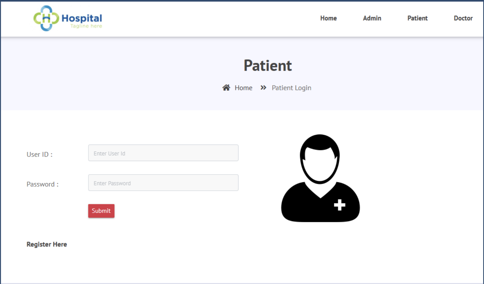
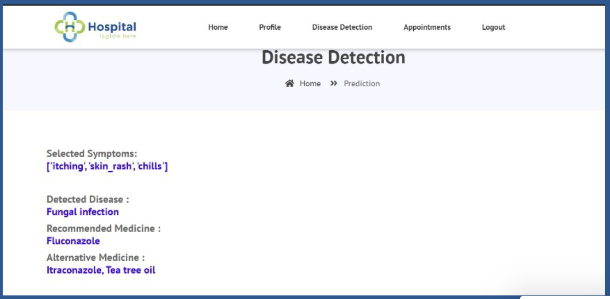
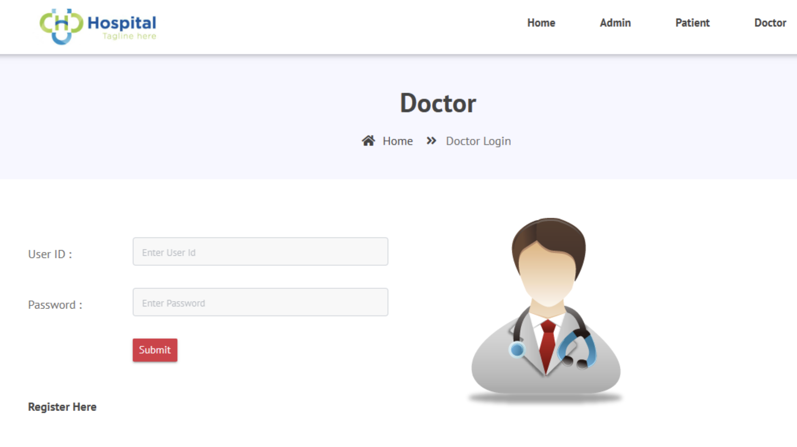
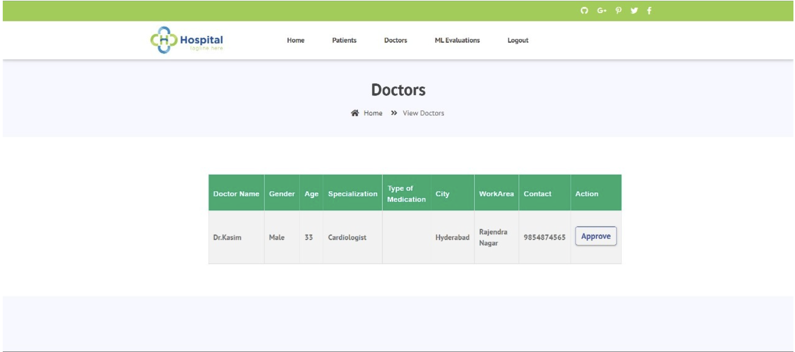
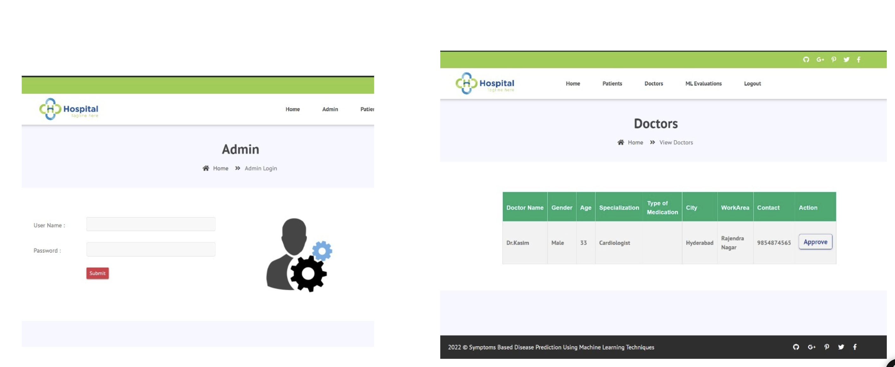
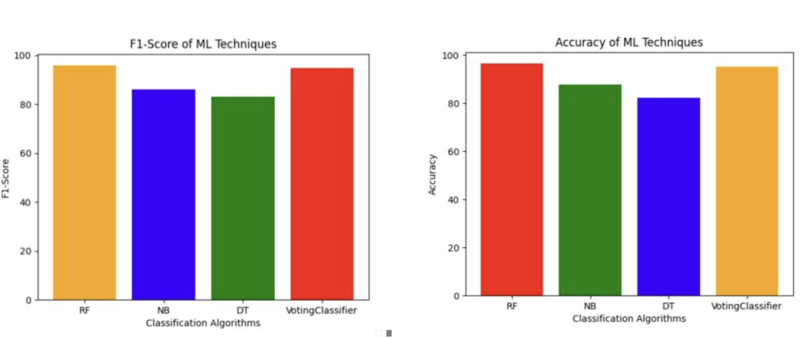
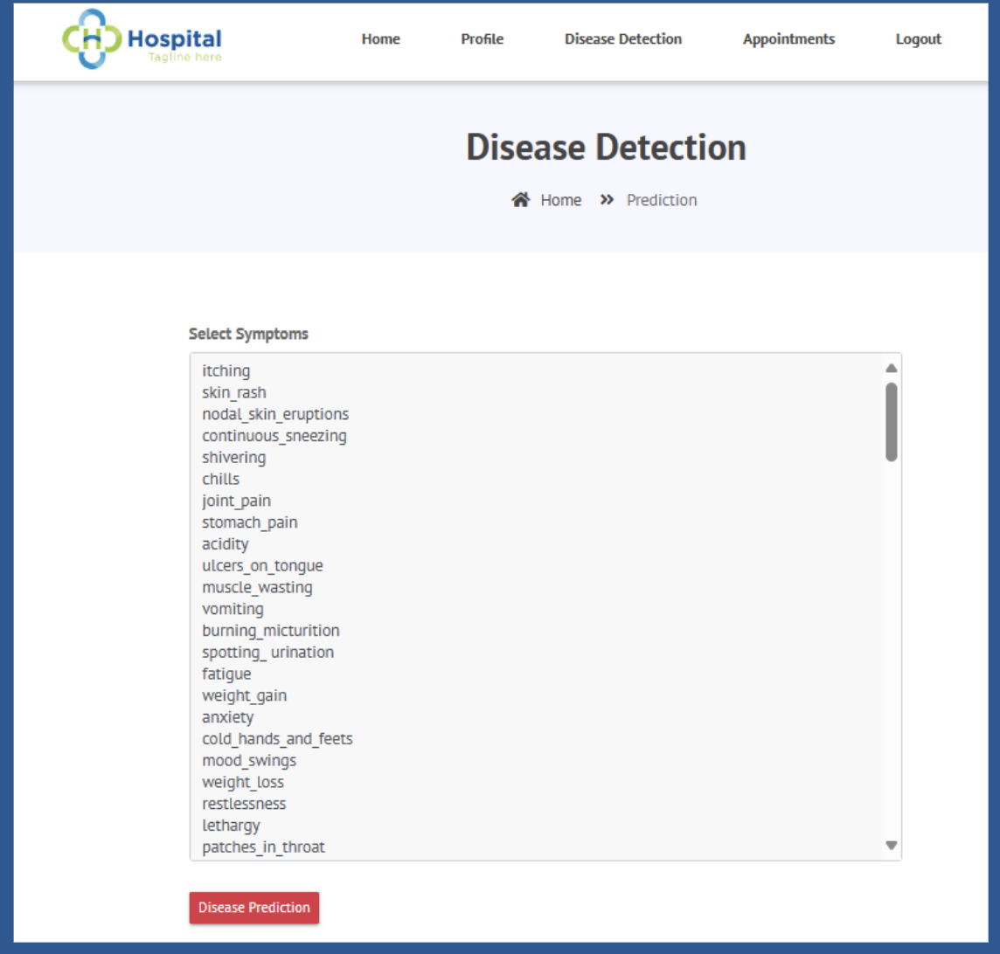

# MED-EASE-ML-DRIVEN-SYMPTOM-ANALYSIS-WITH-AN-EXPERT-DOCTOR-AND-DRUG-RECOMMENDATION-SYSTEM 
UNDERGRAD: MAJOR - PROJECT

## 1. Overview

MedEase is a healthcare decision-support system that identifies diseases based on symptoms, recommends suitable medications, and allows users to book appointments with doctors using an integrated system.

The platform assists users with:
- Disease prediction
- Medication suggestions
- Viewing doctors
- Booking appointments
- Doctor notifications and scheduling

## 2. Proposed System

The proposed system provides:
- Accurate disease recognition based on symptoms
- Primary and alternative medication recommendations
- Doctor recommendations based on the predicted disease
- Doctor appointment booking
- Complete patient–doctor scheduling workflow

### System Architecture Diagram

### E-R Diagram

### Data Flow Diagram

## 3. System Modules

### 3.1 Patient Module
- Register with name, phone number, username, password
- Login to the system
- Enter symptoms
- View predicted disease
- Select doctor and book appointment
- Receive scheduling notifications

#### Patient Login Page

#### Disease Detection Page

#### Output Page

### 3.2 Doctor Module
- Login securely
- View appointment requests
- Approve or reschedule timings
- Notify patients

#### Doctor Login Page

#### Doctor Dashboard

### 3.3 Admin Module
- Login to admin system
- Manage users and appointments

#### Admin Login Page

## 4. Methodology

Multiple Machine Learning models are used for disease prediction:

### Random Forest Classifier
- Handles complex datasets efficiently  
- Achieved 88% accuracy

### Naive Bayes Classifier
- Based on Bayes probability  
- Achieved 86.17% accuracy

### Decision Tree Classifier
- Rule-based tree model  
- Achieved 82.18% accuracy

### Voting Classifier (Best Performance)
- Combines Random Forest, Naive Bayes, and Decision Tree  
- Achieved 95% accuracy  

### ML Evaluation Results

## 5. Dataset Description

Dataset Source (Kaggle):  
https://www.kaggle.com/datasets/kaushil268/disease-prediction-using-machine-learning

Dataset Details:
- 4921 rows  
- 133 symptoms  
- Multi-class classification (disease prediction)

## 6. Implementation Screens

### Symptom List Page

### Patient Interface

## 7. Conclusion

MedEase is a comprehensive healthcare tool designed to streamline the diagnosis and consultation process.  
It offers disease prediction, medication suggestions, and doctor appointment booking within one system.

The system enhances:
- Diagnostic accuracy  
- Healthcare accessibility  
- Patient convenience  

# 8. Authors  

**Ayesha Siddiq**  
**Shamamah Firdous**  
**Umar Javeed Altaf**  
Dept. of CS & AI, MJCET, Osmania University  

# 9. Publication

This project is published in:

**International Journal of Innovative Research in Technology (IJIRT)**  
Volume 11, Issue 2, July 2024  
Paper Title: *Med Ease: ML-Driven Symptom Analysis with Expert Doctor and Drug Recommendations*  
Paper ID: IJIRT 166060  

Full paper available at:  
https://ijirt.org/paper-details/166060

